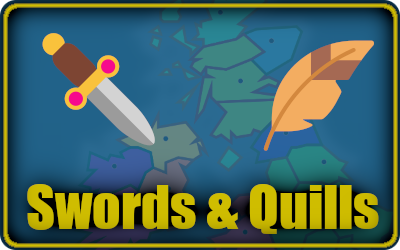

  

# Swords and Quills

Swords & Quills is a grand (tiny?) strategy game set in 13th Century British Isles.

Make your nation the most powerful in the British Isles before the 13th century is over.
Use your armies and ambassadors to ally or conquer other lands.

----

# Play
Play the live version: https://swords-and-quills.dosaki.net/

This is a game developed for [js13kgames 2023 competition](https://2023.js13kgames.com/) where the theme is "**13th Century**".

# Controls
## Mouse
* Mouse wheel to zoom in/out
* Middle click & drag to pan / Shift+Left Click & drag to pan
* Left click regions to select them
* Left click the Build icons to add buildings to the region's empty plots
* Left click the Unit icons to add units
* Right click dismisses your current in-progress action (like placing an ambassador, or selecting where an army should be going).

## Time controls
You can Pause/Play/Play faster with the controls on the top right.
Pause the game if it's becoming overwhelming, but make sure to click Play as some actions only happen when the game's time is ticking.

# Tips
## Getting started
Fill out your title, name and nation name. Then pick one of the existing nations.
Pick a large one if you want to have it easier - larger nations have more territories to build Castles, Mines and Farms.

## Strategies
You can play aggressively, by investing in Farms and Armies and conquering your neighbours.
Or you can play diplomatically, by placing ambassadors in foreign castles and purchasing their territories, or allying with them.
Or a mix of both!

## Units
### Armies
When you create an army it appears in the region sidebar as a square with the number of individuals in that army. Click it to move the army to another territory.

To the left side of the army list, you can merge and split your armies further.

Armies cost gold to train and consume food.

### Ambassadors
Ambassadors increase reputation with the nation where they're deployed. They do this by gifting your gold to that nation.

Ambassadors cost gold and they consume food from both your and the foreign nation resource pool.

## Buildings
### Castles
Increase the region's defense, provide seats for foreign ambassadors and tax the land to give you gold.

### Farms
Produce food to support your (and foreign) ambassadors and armies.

### Mines
Produce gold. You need this to train units and build buildings.
